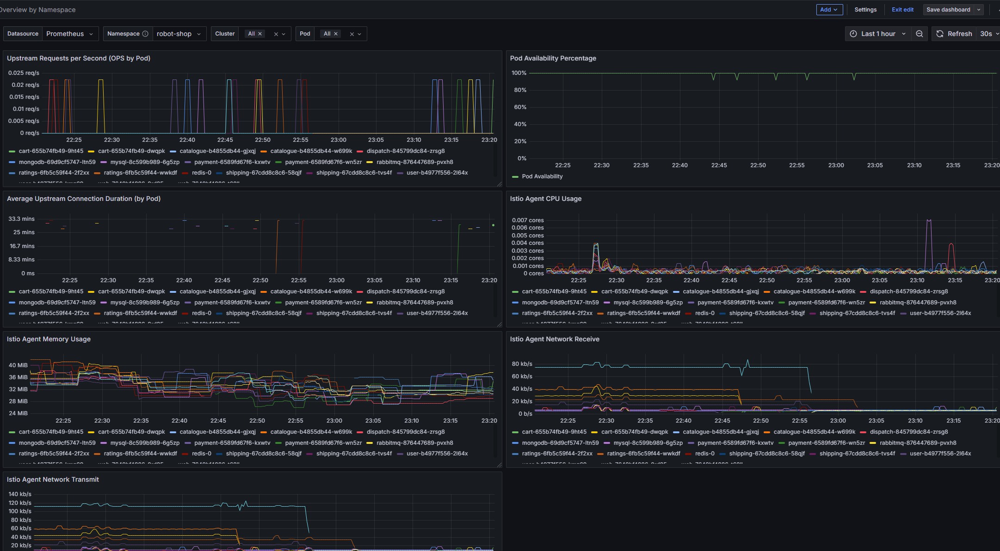
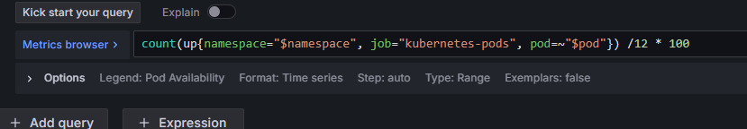

# Robot Shop 故障注入实验设计报告

## 实验目标

本实验旨在测试 Robot Shop 微服务系统在面对随机 Pod 故障时的韧性和恢复能力，特别关注 `envoy_server_live`指标（存活率）的变化。

## 故障注入方法

### 工具选择

- **Chaos Mesh**: 云原生的混沌工程平台，支持各种故障注入类型
- **故障类型**: Pod Kill（模拟节点崩溃）

### 实验设计

#### 时间线（总持续时间 30 分钟）

| 阶段   | 时间范围   | 目标服务          | 故障模式          | 预期影响                       |
| ------ | ---------- | ----------------- | ----------------- | ------------------------------ |
| 1      | 0-3 分钟   | payment           | 杀死单个 pod      | 支付功能中断，订单处理受影响   |
| 2      | 3-8 分钟   | cart, catalogue   | 并行杀死所有 pods | 购物车和商品目录服务完全不可用 |
| 3      | 8-12 分钟  | shipping/dispatch | 随机杀死 50%      | 物流服务部分降级               |
| 4      | 12-18 分钟 | web, user         | 并行杀死所有 pods | 前端和用户认证服务中断         |
| 5      | 18-20 分钟 | ratings           | 杀死单个 pod      | 评分功能受影响                 |
| 恢复期 | 20-30 分钟 | -                 | 无新故障          | 观察系统自动恢复               |

### 指标监控

根据 `metric_mapping.json`，重点监控以下指标：

1. **success_rate (envoy_server_live)**: 服务存活率

   - 计算方法: `(sum(envoy_server_live) / count(envoy_server_live)) * 100`
   - 正常值: >99%
   - 告警阈值: <90%

2. **ops (envoy_cluster_upstream_rq_total)**: 请求总数

   - 反映服务处理能力

3. **duration (envoy_cluster_upstream_cx_length_ms_sum)**: 连接持续时间

   - 反映服务响应速度

4. **资源指标**:

   - cpu: CPU 使用率
   - memory: 内存使用量
   - receive/transmit: 网络 IO

## 预期影响分析

### 直接影响

1. **服务可用性下降**

   - Pod 被杀死后，该服务暂时不可用
   - Kubernetes 会自动重启 Pod，恢复时间约 1-2 分钟

2. **存活率指标变化**

   - 正常状态: ~100%
   - 故障期间: 降至 0%
   - 恢复过程: 逐步上升至 100%

### 级联影响

1. **依赖链影响**

   - web → user, cart, catalogue
   - cart → payment
   - payment → shipping
   - shipping → dispatch

2. **用户体验影响**

   - 页面加载失败
   - 购物车操作失败
   - 订单处理延迟

## 实验执行步骤

1. **环境准备**

   ```bash
   # 确保Chaos Mesh已安装
   kubectl get ns chaos-testing

   # 检查robot-shop服务状态
   kubectl get pods -n robot-shop
   ```

2. **启动监控**

   ```bash
   cd code-25test/robot-shop/choas-mesh
   python monitor-chaos-impact.py &
   ```

3. **应用故障注入**

   ```bash
   kubectl apply -f workflow-experiment.yaml
   ```

4. **实时观察**

   ```bash
   # 查看实验状态
   kubectl get workflow -n chaos-testing -w

   # 查看Pod状态
   kubectl get pods -n robot-shop -w
   ```

5. **收集结果**

   - 监控数据: `data/robot-shop/chaos/*.csv`
   - 事件日志: `data/robot-shop/chaos/chaos_events.json`
   - 分析报告: `data/robot-shop/chaos/chaos_report.md`

## 成功标准

1. **系统韧性**

   - 所有服务能在故障后自动恢复
   - 恢复时间 < 3 分钟

2. **数据完整性**

   - 无数据丢失
   - 事务一致性保持

3. **监控有效性**

   - 能准确捕获存活率下降
   - 告警及时触发

## 风险控制

1. **隔离措施**

   - 仅影响 robot-shop 命名空间
   - 不影响数据库持久化存储

2. **回滚方案**

   ```bash
   # 立即停止实验
   kubectl delete workflow robot-shop-random-pod-kill -n chaos-testing

   # 手动重启所有服务
   kubectl rollout restart deployment -n robot-shop
   ```

3. **监控告警**

   - 存活率低于 50%超过 5 分钟
   - 多个服务同时不可用
   - 系统资源耗尽

实验可视化：


注意：针对不同的微服务，需要在 dashboard 中编辑成功率，将 12 改为你具体的 pod 个数：


同时在 get_nomal.py 中也注意修改。
