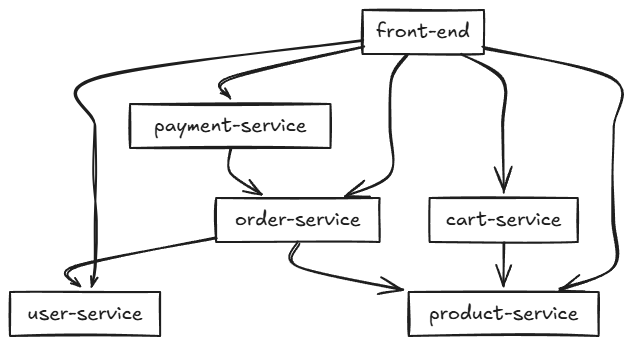

# my_micro 微服务示例

## 服务结构

- user-service：用户服务
- product-service：商品服务
- order-service：订单服务（依赖 user、product）
- cart-service：购物车服务（依赖 product）
- payment-service：支付服务（依赖 order）

## 服务调用关系


服务依赖关系如下：



服务间调用关系说明：

1. user-service（用户服务）
   - 被 order-service 调用获取用户信息
   - 被 front-end 调用

2. product-service（商品服务）
   - 被 order-service 调用获取商品信息
   - 被 cart-service 调用获取商品信息
   - 被 front-end 调用

3. order-service（订单服务）
   - 依赖 user-service 获取用户信息
   - 依赖 product-service 获取商品信息
   - 被 payment-service 调用
   - 被 front-end 调用

4. cart-service（购物车服务）
   - 依赖 product-service 获取商品信息
   - 被 front-end 调用

5. payment-service（支付服务）
   - 依赖 order-service 获取订单信息
   - 被 front-end 调用

## 快速部署
0. 进入 micro-demo 目录
   ```
   cd dataset/micro-demo
   ```
1. 启动 minikube 并启用 istio-injection：
   ```bash
   minikube start
   kubectl create namespace micro-demo
   kubectl label namespace micro-demo istio-injection=enabled
   ```
2. 手动拉取要用到的 python 镜像
   ```
   docker pull python:3.10-slim
   ```
3. 构建 Dcoker 镜像：
   ```bash
   docker build -t user-service:latest ./user-service
   docker build -t product-service:latest ./product-service
   docker build -t order-service:latest ./order-service
   docker build -t cart-service:latest ./cart-service
   docker build -t payment-service:latest ./payment-service
   docker build -t front-end:latest ./front-end
   ```
4. 部署到 Kubernetes
   ```bash
   kubectl apply -f user-service/k8s.yaml -n micro-demo
   kubectl apply -f product-service/k8s.yaml -n micro-demo
   kubectl apply -f order-service/k8s.yaml -n micro-demo
   kubectl apply -f cart-service/k8s.yaml -n micro-demo
   kubectl apply -f payment-service/k8s.yaml -n micro-demo
   kubectl apply -f front-end/k8s.yaml -n micro-demo
   ```
5. 将本地 Docker 的镜像加载到 Minikube 中（待优化，部署文件是不是可以直接部署到 minikube 中）
   ```bash
   minikube image load user-service:latest
   minikube image load product-service:latest
   minikube image load order-service:latest
   minikube image load cart-service:latest
   minikube image load payment-service:latest
   minikube image load front-end:latest
   ```
6. 检查服务状态
   ```bash
   kubectl get pods -n micro-demo
   kubectl get svc -n micro-demo
   ```
7. 查看前端 front-end
   ```bash
   minikube service front-end -n micro-demo
   ```
（可选）删除现有部署和服务
   ```bash
   kubectl delete deployment,service -n micro-demo --all
   kubectl delete namespace micro-demo
   ```

## Istio 监控

- 部署在带有 istio-injection 的 namespace 下，Istio 会自动注入 sidecar。
- 可通过 Kiali、Jaeger、Prometheus 等工具可视化服务间调用链。

## 目录结构

```
micro-demo/
├── user-service/
├── product-service/
├── order-service/
├── cart-service/
├── payment-service/
├── front-end/
└── README.md
``` 